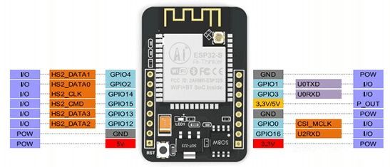
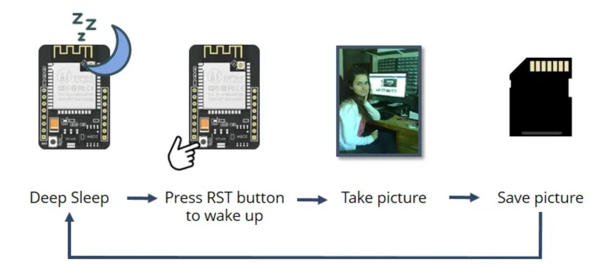
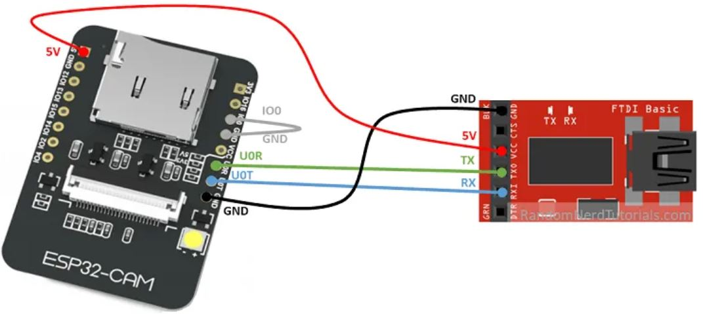

# ESP32-CAM

### Encouraged by  <a href="https://appiko.org/">Appiko</a>

### OBJECTIVE
To capture an image using ESP32-CAM ,OV2640 and saving it in SD card.

### INTRODUCTION

  

ESP-32 CAM can be widely used in various IOT applications.It is suitable for home smart devices,industrial wireless control,wireless monitoring,QR wireless identification,wireless positioning system signals and other IOT applications.It is an ideal solution for IOT applications.
 

### Methodolgy

  

<ul>
  <li>The ESP32-CAM is in deep sleep mode.
    <li>Press the RESET button to wake up the board.
      <li>The camera takes a photo.
        <li>The photo is saved in the microSD card with the name: pictureX.jpg, where X corresponds to the picture number.
          <li>The picture number will be saved in the ESP32 flash memory so that it is not erased during RESET and we can keep track of the number of photos taken.
            </ul>
            
 
 To upload the code we can use a FTDI programmer as shown:
  

<Note:Tried with arduino instead of FTDI ,but didn't work,better to use FTDI programmer,will return with solution.>

